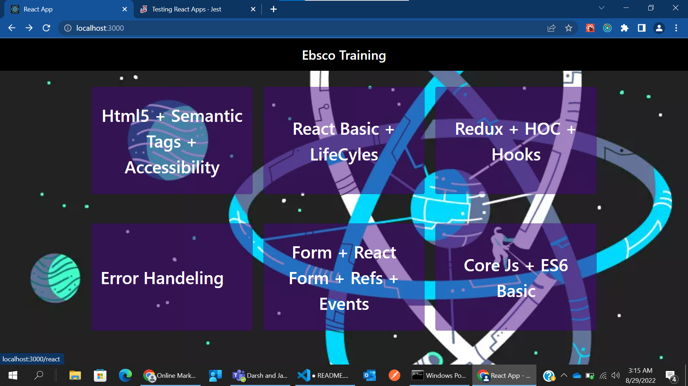
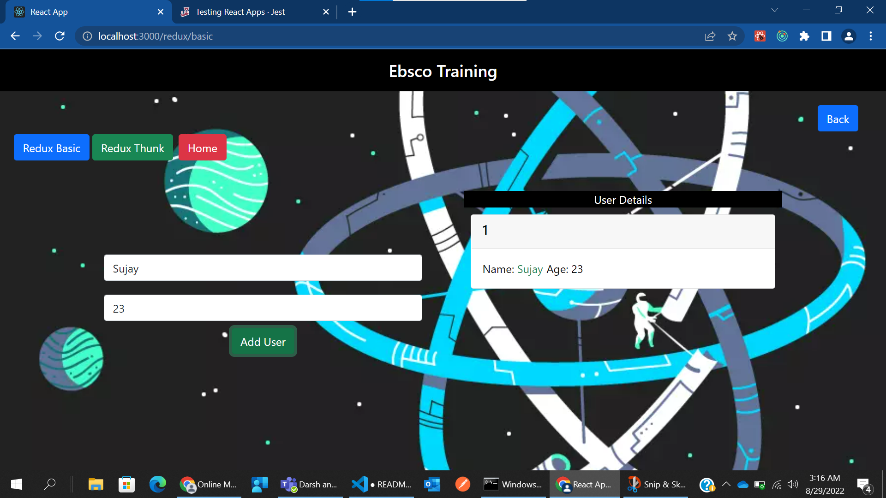
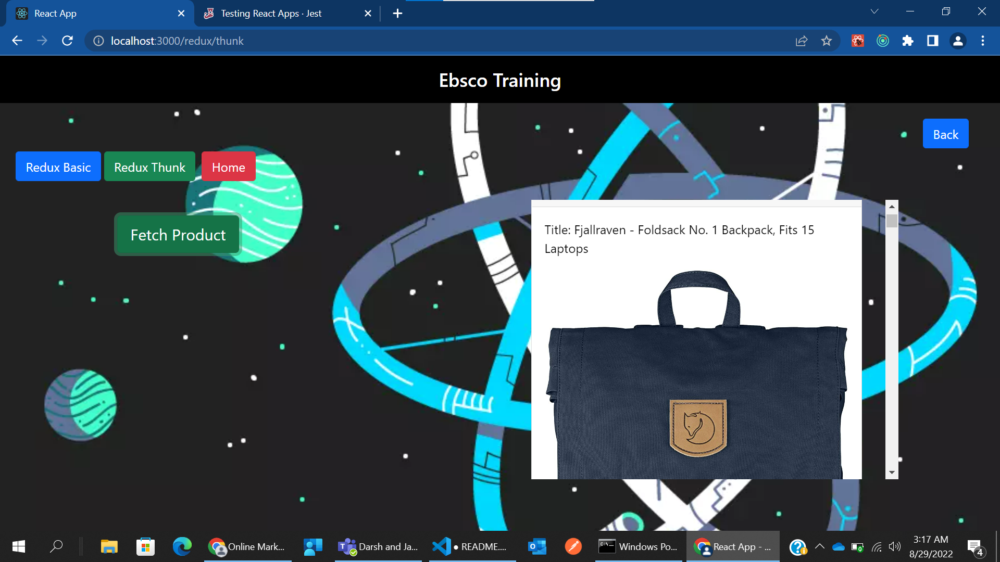
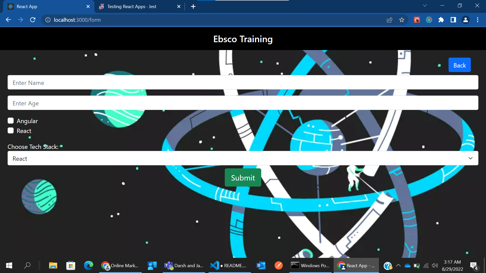

### Ebsco Training
#### Concept Covered
###### Html 5 Features
* Semantic tags
* HTML tag attributes 
* Learn about accessibility
* Creating forms with different input types (radio,textbox,checkbox,select)
* Inline/external/internal CSS
* Media Queries (Responsive Design)
* Flexbox / Grid
* CSS Preprocessors (eg less,saas)
* Relative and Absolute Units (em, %, px, pt etc.)

###### Other Imp Topics
* Core JS - Intermediate
* HTML5 - Intermediate
* CSS3 (including pre-processors) - Intermediate 
* ES6+- Intermediate
* Typescript/Babel - Novice
* Unit testing (basics) - Novice

###### React Basics - Intermediate
* Props. State, Components, lifecycle events, Forms, syntethic events, Refs, Keys
* React Router - Intermediate
* React HOC - Intermediate
* React Redux - Advance
* Unit/Integration Testing- Advanced
* React Hooks - Advanced
* Ways for State Management - Advanced
* Code Splitting/ lazy loading - Advanced
* Error Handling - Advanced

### Ebsco Training
#### Concept Covered
###### Html 5 Features
* Semantic tags
* HTML tag attributes 
* Learn about accessibility
* Creating forms with different input types (radio,textbox,checkbox,select)
* Inline/external/internal CSS
* Media Queries (Responsive Design)
* Flexbox / Grid
* CSS Preprocessors (eg less,saas)
* Relative and Absolute Units (em, %, px, pt etc.)

###### Other Imp Topics
* Core JS - Intermediate
* HTML5 - Intermediate
* CSS3 (including pre-processors) - Intermediate 
* ES6+- Intermediate
* Typescript/Babel - Novice
* Unit testing (basics) - Novice

###### React Basics - Intermediate
* Props. State, Components, lifecycle events, Forms, syntethic events, Refs, Keys
* React Router - Intermediate
* React HOC - Intermediate
* React Redux - Advance
* Unit/Integration Testing- Advanced
* React Hooks - Advanced
* Ways for State Management - Advanced
* Code Splitting/ lazy loading - Advanced
* Error Handling - Advanced

#### Some ScreenShots
 
 
 
 
